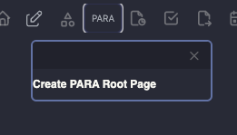
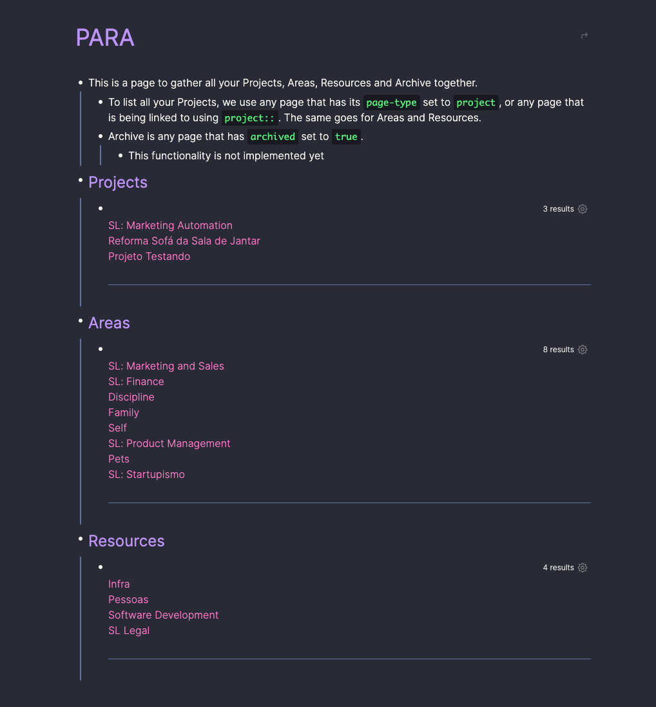
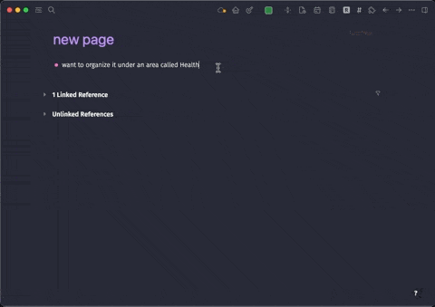
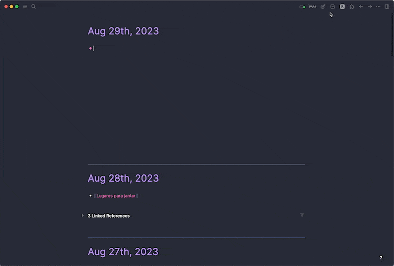

# Logseq Plugin: Add PARA Properties

Enhance your Logseq experience with this plugin that streamlines the implementation of the [PARA Method by Tiago Forte](https://www.tiagoforte.com/para). Organize your work, knowledge, and projects effortlessly by adding custom slash commands to your Logseq environment.

If you find this project valuable, please consider [starring it on GitHub](https://github.com/georgeguimaraes/logseq-plugin-add-PARA-properties).

## Installation

To add the "PARA Method Properties" plugin to your Logseq app, follow these steps:

1. Open your Logseq app and go to the Plugin Marketplace.
2. In the search bar, type "Add PARA Properties" and press Enter.
3. Find the plugin in the search results and click "Install" to add it to your Logseq setup.

## About

The PARA Method, pioneered by Tiago Forte, is a powerful framework for structuring your digital life. This plugin is designed to make Logseq a more suitable tool for applying the PARA Method.

Our goal is to provide an efficient way to associate your current Logseq page with Projects, Areas, or Resources, ensuring that your knowledge management system aligns seamlessly with the PARA Method principles.

## Usage

This Logseq plugin introduces a set of slash commands that streamline the categorization of your content:

- **Project \[file this page under a project\]**: Associates the current page with a project.
- **Area \[file this page under an area\]**: Associates the current page with an area.
- **Resource \[file this page under a resource\]**: Associates the current page with a resource.

Each command creates a corresponding property (e.g., `project::`, `area::`, or `resource::`) on the current page. This property allows you to link to an existing or new page. I recommend using the syntax `[[Renovation Project]]` to be able to click the link.

## Setup for Projects, Areas, and Resources

To categorize your pages under Projects, Areas, or Resources, we recommend using a `page-type` property. You can set this property manually, or use the following slash commands for a more streamlined setup:

- **Make this page a Project [using page-type]**
- **Make this page an Area [using page-type]**
- **Make this page a Resource [using page-type]**

By adopting these properties, you can easily categorize your content and efficiently query for pages related to your projects, areas, and resources.

## PARA Root Page

Create a central hub for your Projects, Areas, Resources, and Archives by utilizing the menu bar. This central hub provides a quick overview of your PARA-structured content, making navigation and organization straightforward.

## Demo

Visual demonstrations of how this plugin enhances your Logseq experience:

## Recommendations

For a visually pleasing and informative experience, consider integrating the [Awesome Props](https://github.com/yoyurec/logseq-awesome-props) plugin. This extension allows you to add appealing icons to your properties across all pages, making your Logseq workspace more visually engaging.

Feel free to reach out if you have any questions or feedback. I hope you find this plugin useful in optimizing your use of Logseq and the PARA Method. Enjoy!

---

**Note:** Be sure to check out the original [PARA Method by Tiago Forte](https://www.tiagoforte.com/para) to dive deeper into the principles and concepts behind this organization system.
