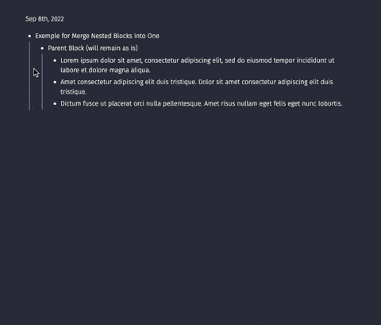

# Add PARA properties

I wanted a quick way to link the current page to a Project, Area or Resource that I already have in Logseq.

That's why I created this plugin.

## Usage

This plugin gives you new slashes commands:

- Project [file page under a project]
- Area [file page under an area]
- Resource [file page under a resource]

Each will create a new property (`project::`, `area::` or `resource::`) into the current page. I use it to link to an existing (or new page) using `[[ New Page ]]`. This way the link is clickable.

### Setup for Projects, Areas and Resources pages

For each Project, Area or Resource, I use the following property:

```
  page-type: project # or `area`, `resource`
```

You can also use these slashes commands to setup the page-type property:

- Make this page a Project [using page-type]
- Make this page an Area [using page-type]
- Make this page a Resource [using page-type]

This is my workflow. I use those properties to query for pages related to projects, areas and resources.

## Demo



## Recommendations

I also use [Awesome Props](https://github.com/yoyurec/logseq-awesome-props) to have some cool icons for properties in all pages.
